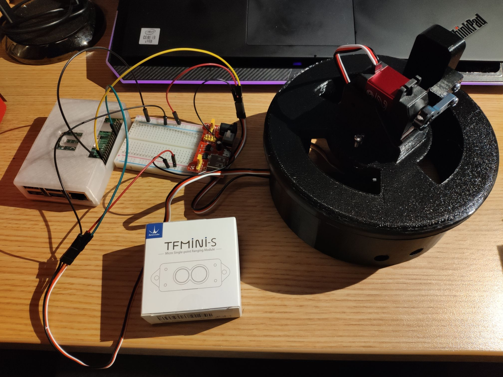
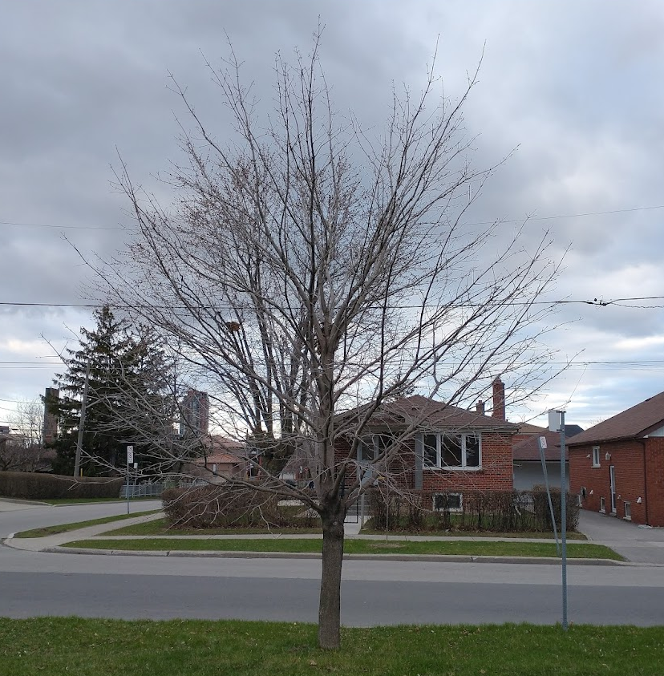
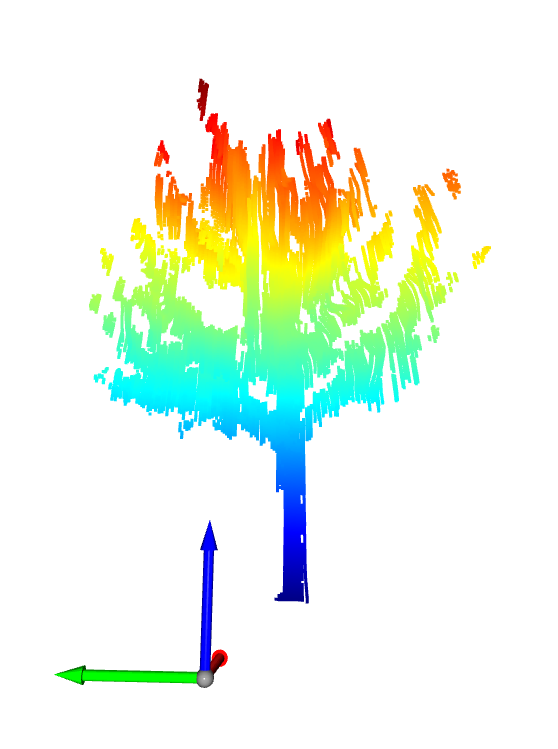

# TreeDAR

It scans trees.

This repo contains code for this thing:

Which turns this:

Into this:

Note: This was ~~hacked together~~ *ahem* "rigorously and intentionally engineered" for Praxis II Showcase in a little over a week (and somehow miraculously works), so the code is quite messy.

Designed by Team R4206: Andy Gong (@andygongexe), Nikhil Thiyagarajan (@freezedcheese), Tyler Tian (@tylertian123), and Kabir Dhillon.
